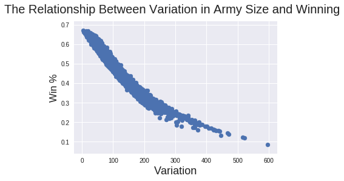

# Understanding Fantasy Basketball with Game Theory
## Introduction
Although not as well known as Fantasy Football, Fantasy Basketball is an fun game for fans to play during the NBA season. Fantasy sports use a real sport as a data source (for basketball this means how many points, assists, steals, turnovers etc. are accumulated), and then use that data to compete against other in-league teams every week. The following is part white paper, part guide to winning, and part documentation of the code. It is the first attempt I'm aware of that uses Blotto games as a model for Fantasy Basketball as well as the first attempt I'm aware of finding a dominant Blotto strategy against random strategies. [For the curious, this paper](https://www.semanticscholar.org/paper/%E2%80%9C-Solving-%E2%80%9D-the-Blotto-Game-%3A-A-Computational-Wittman/241ba18a3819a3341ef091eb99b10dc510f28ef0) does something similar, but against a selection of pre-defined strategies.

## How Fantasy Basketball is Played:
At the start of the season, each person in a fantasy league picks a team (called drafting). Picking well in the draft is incredibly important for doing well during the season because the players available mid-season are not very good. Each week during the season, our team goes up against another team in our league in a head-to-head matchup. The winner of this head-to-head matchup is whichever team wins the most number of statistical categories. In a 9 category league, this means you need to win at least 5 categories to win that week. Those categories are Points, Rebounds, Blocks, Assists, Steals, Turnovers (lower is better), 3-point shots made (3PM), Free Throw % (higher is better), and Field Goal % (higher is better). The more weeks you win, the better. 
 
## Figuring Out What a Good Player Looks Like
Good NBA players help our team win by contributing to each of the statistical categories (in various amounts). We need to develop a way to evaluate how good each player is before the season starts so that we can plan our draft.

The first step is either creating player statistical projections with machine learning or using other projections (for the upcoming season). For example [basketball-reference's projection system](https://www.basketball-reference.com/friv/projections.cgi).

The next step is turning the raw statistics into something comparable across categories. We can do this by figuring out the standard deviation of each category. A general but good metric for how much a player contributes to your team over the course of a season is to sum the standard deviations of all categories. Free Throw % and Field Goal % are more tricky because players who shoot a lot of free throws or who shoot a lot of field goals have a much larger impact on our weekly team %, so you need to scale those categories appropriately. You can find my implementation in Projections.xlsx.

There's one more element crutical for winnning the game: picking the right team distribution across categories.

A common strategy in fantasy basketball is called “punting” and it means to intentionally draft players who are bad at one or two categories but are strong in other areas. You can read more about [punting here](https://www.rotoballer.com/how-to-punt-categories-in-fantasy-basketball/538425).

Punting is a common strategy, but how can we evaluate if this is even a good strategy?

## Using Game Theory to Model the Situation:
We can use game theory to model this situation. A model is just simplified version of reality that lets us make predictions and gives us some insight.

In classical game theory there is something called a Blotto game that shares some characteristics with Fantasy Basketball.

The setup of a Blotto game is simple: two colonels are fighting a war with equal sized armies. Each army is split across different areas called “battlefields”. If a colonel has more troops on a battlefield than the other colonel, that colonel wins that battlefield with their size majority, and if they win more battlefields than the other colonel they win the war. 

For example, if colonel 1 had 10 troops deployed across battlefields 1-5 as [1, 2, 4, 2, 1] against colonel 2’s troop distribution of [2, 0, 0, 3, 5]: 1<2, 2>0, 4>0, 2<3, 1<5, so colonel 2 wins 3 battlefields and colonel 1’s only wins 2 battlefields, so colonel 2 wins the war. In a more visually understandable way:
  ```
  Col 1 | Col 2
    [1] < [2]
    [2] > [0]
    [4] > [0]
    [2] < [3]
    [1] < [5]
  
  Battlefield Totals:
  2 < 3
  
  Troop Totals:
  10 = 10
  ```
This theoretical game has no "best" strategy defined by Game Theory, because if a colonel adjusts their troops before battle, there will always be a strategy that the opposing colonel can change to that will beat them. The Blotto game solution is cyclical. Almost every strategy is viable except for a strategy that puts 0 troops into more than half the number of battlefields e.g. [10, 0, 0, 0, 0] or [0, 0, 0, 5, 5] because those will always lose. Assuming no prior information about the opposing colonel’s choices, there isn’t a dominant strategy.

If instead we assume opposing colonels play random strategies, we can find the best strategies using a Monte Carlo simulation.

## Solving With Monte Carlo Simulation:
When we graph the variance of troop distribution across battlefields, We see how this plays out below



Basically, the less variance, the better. The ideal distribution is having each battlefield with the same number of troops.

### -----If you're not interested in how the code works, feel free to skip the rest of this section----- 

Here's a short explanation of each function:
note: parameters are in italics

### gen_random_blotto(*integers*=True): 
 
Description: generates a random strategy, for 9 battlefields with 100 troops
  
Parameters:
 - *integers* ~ if True, the Troop values in each battlefield will be integers, if False, they are floats.
   
Output: 
 - 9 item list of ints or floats
 
### gen_blotto_tuple(*number_of_strategies*, *use_integers*=True)
 Description: generates a tuple with a bunch of random strategies
  
 Parameters:
  - *number_of_strategies* ~ The number of strategies you want in your tuple
  - *use_integers* ~ if True, the Troop values in each battlefield will be integers, if False, they are floats.

 Output: 
  - (s1, s2, s3, ... , sX)
  
### single_test(*nopponents*, *use_integers*=True, *strategy*=None, *pregenerated_list*=None, *show_var*=True)
 
 Description: This test determines the win % of a given (or random) strategy 
 
 Parameters:
  - *nopponents* ~ The number of opponents you want your strategy to be tested against 
  - *use_integers* ~ if True, the Troop values in each battlefield will be integers, if False, they are floats.
  - *strategy* ~ You can test a single strategy, if None this is random
  - *pregenerated_list* ~ You can test against a list of strategies, if None the strategies tested against are random
  - *show_var* ~ Used for making the graph comparing variance with win %
  
 Output:
  - (How often *strategy* wins, *strategy*)
  
### best_test(*nstrategies*, *nopponents*, *use_ints*=True, *fast*=True, *show*=10, *show_var*=True, *return_list*=None)

 Description: Tries out *nstrategies*, each against *nopponents* to find the best one.
 
 Parameters:
  - *nstrategies* ~ The number of strategies you want to test 
  - *nopponents* ~ The number of opponents you want your strategy to be tested against 
  - *use_ints* ~ if True, the Troop values in each battlefield will be integers, if False, they are floats.
  - *fast* ~ if fast=True, algorithm is improved speed-wise by comparing vs the same list of opponents
  - *show* ~ if return_list=False, best_test prints the top *show* strats
  - *return_list* ~ if True, the function returns a list, if False, it prints that list 
  - *show_var* ~ Used for making the graph comparing variance with win %
  
 Output:
  - a list of the strats by win % or None (printing the top *show* strats)
  
You can find a Google Colab version of my code here: 
https://colab.research.google.com/drive/1LsDSJjSjAm6-GpNWeZaUOzb9emaiseXA

## Big Takeaway
All else being equal, having your players' categorical strengths spread across all your categories is better than having them concentrated in only some categories.

## Further Work
Future work could use reinforcment learning to create a drafting bot and optimize based on who other players in the pool (and projections). In addition, a more detailed model could take the NBA schedule into account and optimize futher based on that.
